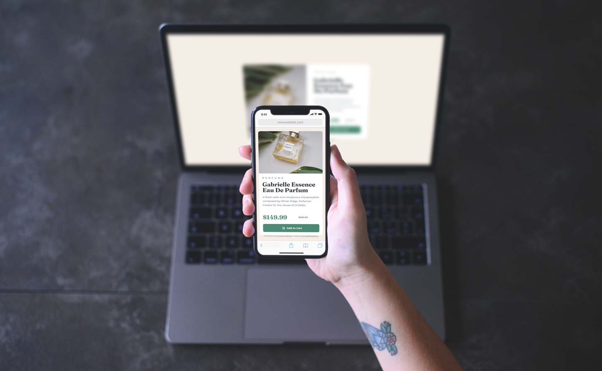
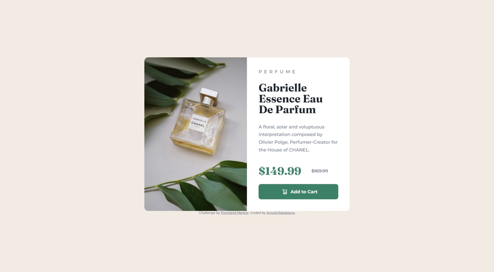
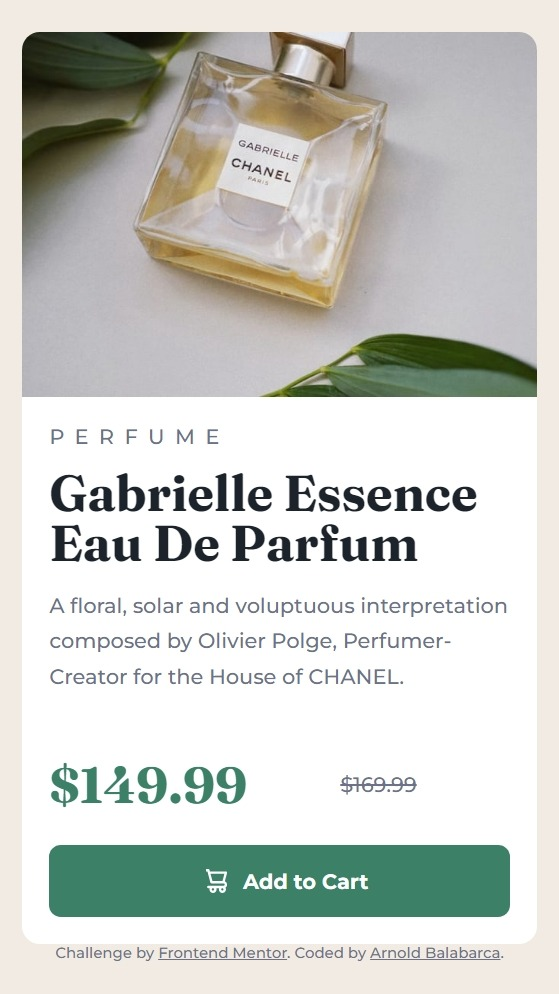

# Frontend Mentor - Product preview card component solution

This is a solution to the [Product preview card component challenge on Frontend Mentor](https://www.frontendmentor.io/challenges/product-preview-card-component-GO7UmttRfa). Frontend Mentor challenges help you improve your coding skills by building realistic projects. 

## Table of contents

- [Overview](#overview)
  - [The challenge](#the-challenge)
  - [Screenshot](#screenshot)
  - [Links](#links)
- [My process](#my-process)
  - [Built with](#built-with)
  - [What I learned](#what-i-learned)
  - [Useful resources](#useful-resources)
- [Author](#author)

**Note: Delete this note and update the table of contents based on what sections you keep.**

## Overview

### The challenge

Users should be able to:

- View the optimal layout depending on their device's screen size
- See hover and focus states for interactive elements

### Screenshot






### Links

- Solution URL: [Add solution URL here](https://your-solution-url.com)
- Live Site URL: [Add live site URL here](https://your-live-site-url.com)

## My process

### Built with

- HTML box model
- Flexbox
- Mobile-first workflow


### What I learned

After making the HTML structure, I started by linking the font families and creating some global variables for the main and neutral color, as well as for the font size.
```css
:root{
      /*Primary*/
      --dark-cyan: hsl(158, 36%, 37%);
      --cream: hsl(30, 38%, 92%);

      /*Neutral*/
      --very-dark-blue: hsl(212, 21%, 14%);
      --dark-grayish-blue: hsl(228, 12%, 48%);
      --White: hsl(0, 0%, 100%);
      
      /*Font-size*/
      --para: 14px;
      --title: 34px;
    }
```
Later on, I set propierties box-sizing: border-box;, setting marging and padding to 0, so I can set the size of elements easily.
Also, I set some proprieties by default such as font-family and font-size:

```css
 *{
      box-sizing: border-box;
      margin: 0;
      padding: 0;
      font-family: 'Montserrat', sans-serif;
      font-size: var(--para);
    }
```

I used flexbox and its properties to organize the elements and make them responsive. For example, I used row direction for the mobile version and column direction for the desktop version.
```css
.product-description{
      display: flex;
      flex-direction: column;
      justify-content: space-between;
      height: 65%;
    }
```

### Useful resources

- [HTML box model](https://www.w3schools.com/css/css_boxmodel.asp) - This helped me undertanding the boc moddel we have to follow at maketing a web site.

- [CSS flexbox](https://css-tricks.com/snippets/css/a-guide-to-flexbox/) - This is an amazing guide which helped me finally understand Flexbox properties. I'd recommend it to anyone still learning this concept.


## Author

- Github - [Arnold Balabarca](https://github.com/arn28)
- Frontend Mentor - [@arn28](https://www.frontendmentor.io/profile/arn28)